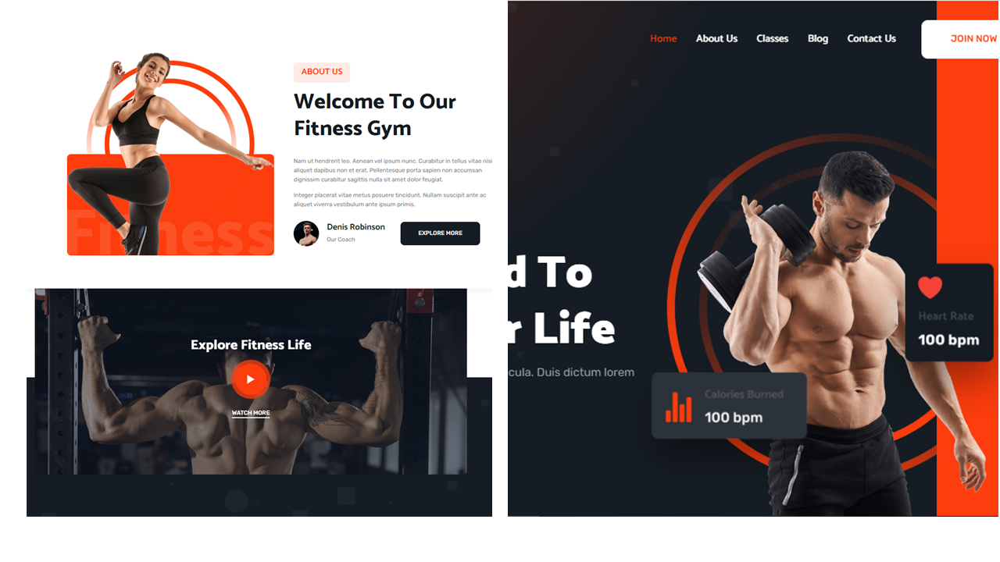

<div align="center">

  <h1 align="center">🏋️‍♀️Fitness - push-ups or pull-ups?...🏋️‍♀️</h1>

  Fitness is fully responsive calisthenics and bodybuilding website, <br /> The website is available in both front-end as well as back-end formats and contains all necessary data

<br>

  <a href="https://ayseuluxan.github.io/lifewithfitness/"><strong> 📺 Live </strong></a> 

</div>

<br />

### ☑ Preview



### ☑ Requisites

Before you begin, ensure you have met the following requirements:

* [Git](https://git-scm.com/downloads "Download Git"), [Python](https://www.python.org/downloads/) must be installed on your operating system.

<br>

### ☑ Run 

<br>

🟢 To run **Fitness** locally, run these commands:

<br>

⭐ Move to folder_name:

```bash
cd folder_name
```

⭐ Install requirements for the project:

```bash
pip install -r requirements.txt
```

⭐ Migrations to the database:

```bash
python manage.py makemigrations
```

```bash
python manage.py migrate
```

⭐ To start/run project :

```bash
python manage.py runserver
```

* After executing the command above, you can see website on [127.0.0.1:8000](http://127.0.0.1:8000/)


⭐ To switch to admin panel:

```bash
python manage.py createsuperuser
```

<br>

### ☑ Technologies used

<br>

<div align="center">


</div>

<br>

### ☑ Contact

If you want to contact me, you can reach me over [Facebook](https://www.facebook.com/profile.php?id=61552988346259&mibextid=ZbWKwL), [Instagram](https://instagram.com/uluxanova_.a), [Linkedin](https://www.linkedin.com/in/ay%C5%9F%C9%99-u-8b37b8219/)

<br>

### ☑ License

This project is licensed by [MIT](https://choosealicense.com/licenses/mit/) and contains respective license information


<br>

### ☑ Creators

The project got prepared by collaborative actions of [Sahil](https://github.com/salahlisahil) , [Aleksey](https://github.com/alexop89056), [Aisha](https://github.com/AyseUluxan)

<br>

<div align="center">
  
  
  
  
[](https://twitter.com/)
  [](https://youtube.com)
  


</div>
